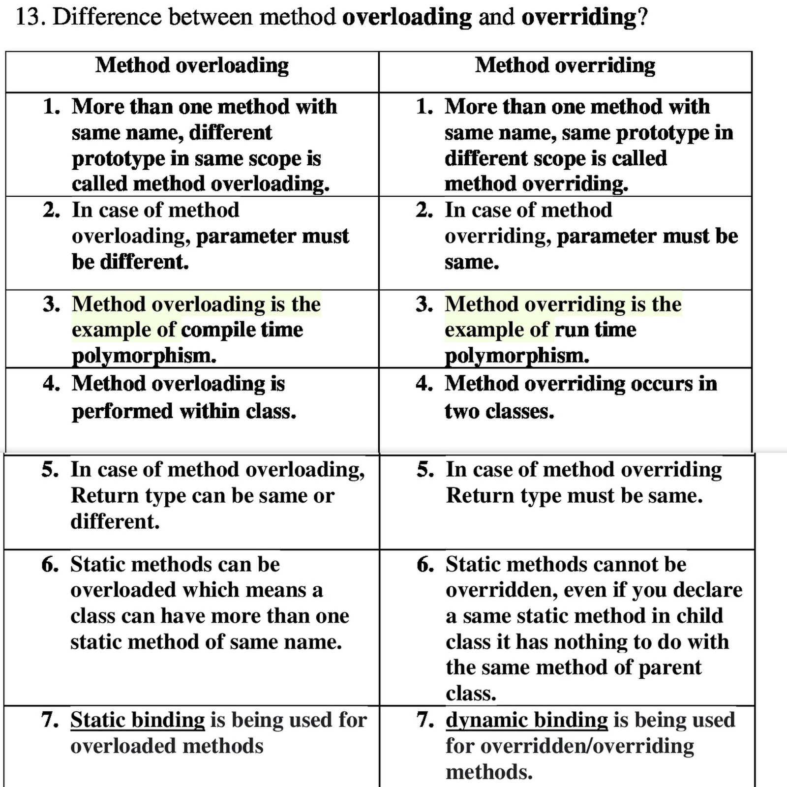
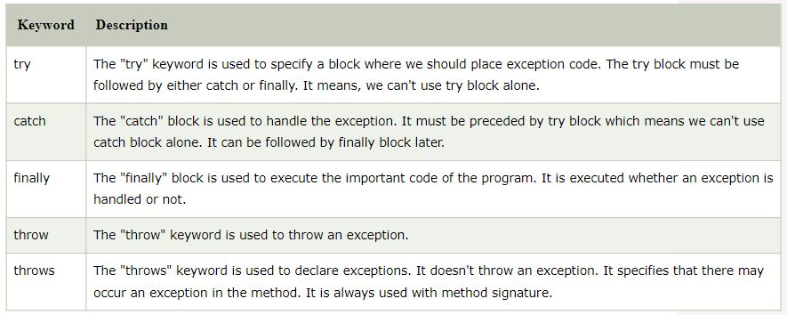
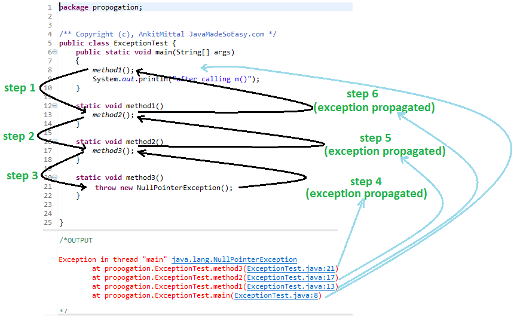

# interviewprep

# OOP

### what is oop ?

- OOP is a programming approach to solve problems. OOP is way of solving problems by representing problem with real life entities eg. Car, bus, Fruit in programming.
- main aim of oop is binding the data and function which operates on them together.
- programming approach.
- better than POP.
- faster than POP.
- easy to implement.

### Encapsulation:

- Encapsulation is binding the data and code (functions/operations) together into single unit.
- Encapsulation is achieved when objects keeps it state private (cannot give access to outside world if we do object states can be changes directly by outside world without going the steps we want to)
- manages own state by interfaces(functions).
- eg, Cat (with states and operations. state is private. change state of objects only through the interfaces called functions).

```java
class Cat{
    // state of object or a cat
    private int hunger;
    private int sleep;
    // private state
    private String name;
    private String breed;

    public Cat(){
        this("", 0, 0, "");
    }

    public Cat(String name, String breed){
        this(name, 0, 0, breed);
    }

    public Cat(String name, int hunger, int sleep, String breed){
        this.name = name;
        this.breed = breed;
        this.hunger = hunger;
        this.sleep = sleep;
    }

    // public methods are operations which changes state of object(Cat)
    public void feed(){
        if(hunger > 0){
            hunger--;
        }
    }

    public void sleep(){
        if(sleep < 10){
            sleep++;
        }
    }

    public void setBreed(String bree){
        if(Breed.isValidBreed(bree)){
            breed = bree;
        }
    }
}

// just class with helper method (isValidBreed)
// which tells us if the breed is valid or not
class Breed{
    public static boolean isValidBreed(String breed){
        // checking here if breed is valid or not
        // this may contains API calls or Database lookup
        return breed.contains("cat");
    }
}
```

```java

// driver code for using above class

// creating the object of Cat class
    Cat c3 = new Cat("mani", 45, 40, "tri pn mahiti nahi");

    // if any state object is public
    // here if breed was public it can change the state of object directly
    // and this change will be not processes through the operation it meant to be

    //c3.breed = "blha ";

    // the correct wAy to change the state ob objects
    c3.setBreed("cat bc");

```

### Abstraction :

- Abstraction is an extension of encapsulation.
- showing only neccesary information, relevant(method privatization) and hiding implementation details.
- exposing only high level example.
- Abstraction can achieved with abstract classes and interfaces and classes also (in java).
- Coffee machine example :
  - in a coffee machine there are buttons and switches present but we dont know how coffee machine internally works.
  - in the same way when we achieve abstrction using interfaces or abstract classes we achieve absrtaction
  - by assigning instance of class to reference of abstract class or interface we can achieve abstraction (abstract class - half abstraction, interface - full abstraction).
- Linkedlist example(make only those methds public whi), Phone example (screen buttons are used to operate phone but we dont know how phone internally works.).

#### with interfaces

```java

interface Phone{
    void call();
}

interface SmartPhone extends Phone{
    void touch();
    void pressVolDown();
    void charge();

    default void nonab(){

    }
}
class Android implements SmartPhone{

    @Override
    public void touch() {
        System.out.println("touched");
    }

    @Override
    public void pressVolDown() {
        System.out.println("pressing down");
        keepVolumeDown();
    }

    @Override
    public void charge() {
        System.out.println("charging");
    }

    public void keepVolumeDown(){
        System.out.println("keeping volume down");
    }

    @Override
    public void call() {
        System.out.println("calling");
    }
}
```

driver code:

```java

SmartPhone sf = new Android();
// the SmartPhone's reference sf will only able to access those methods which are declared inside SmartPhone Interface


Android a = new Android();
// Android's reference a will be able to access all public methods of class Android
a.keepVolumeDown();
sf.call();

// we are giving access to only those methods which are neccessy to operate with SmartPhone
```

#### with abstract classes

```java
abstract class Animal{
    String name;
    public Animal (String name){
        this.name = name;
    }

    public String getName(){
        return name;
    }

    abstract void sound();
}

```

#### extending 'Animal' class by 'Dog' and 'Cat'

```java
class Dog extends Animal{
    public Dog(String name){
        super(name);
    }

    @Override
    public void sound(){
        System.out.println("bow bow!");
    }
}

class Cat extends Animal{
    public Cat(String name){
        super(name);
    }

    @Override
    public void sound(){
        System.out.println("meow meow!!");
    }
}

```

driver code:

```java

class Driver{
    public static void main(String args[]){
        Animal dog = new Dog("Moti");
        Animal cat = new Cat("mani");

        // common method of abstrct class 'Animal'
        System.out.println(dog.getName());
        System.out.println(cat.getName());

        // below both sound method have different implementation/ thier own implementation.

        cat.sound();
        dog.sound();

        // here with abstract class we are using common method getName() and also providing different implementation whenever needed (called half abstraction).
        // but we dont have to know about that how both of these classes implement the sound() method we can just use it like that.
    }
}

```

### Inheritace :

- reusabilty
- Inheritance in Java is a mechanism in which one object acquires all the properties and behaviors of a parent object. It is an important part of OOPs (Object Oriented programming system).
- piller which satisfies DRY(dont repeat yourself) property of
- Father gives his property to child
  - father got that properties from child’s grandfather
  - so child is the taker and father is giver
  - hence father works as a base class and child as derived class.
  - You can explain is that the child couldn’t give its property to father so Inheritance is one sided.
  - For multiple inheritance you can think of mother+father both are parent and give some of their properties to child!

#### real life example:

##### superclass 'Person'

```java
class Person{
    String name;
    char gender;
    Address address;

    public Person(String name, char gender, Address address){
        this.name = name;
        this.gender = gender;
        this.address = address;
    }

    public String getName(){
        return name;
    }

    public char getGender(){
        return gender;
    }

    public Address getAddress(){
        return address
    }
}

```

##### subclass Student

```java
class Student {
    int roll;
    String school;
    // here all public, protected, default members are accessible
    // we can reuse superclass members here

    public Student(String name, char gender, Address address, int roll, String school){

        super(name, gender, address);
        // above super statement we are using super class constuctor


        this.roll = roll;
        this.school = school;
    }

    public int getRoll(){
        return roll;
    }

    public String getSchool(){
        return school;
    }
}
```

##### Driver class

```java
class Driver{
    public static void main(String args[]){
        Student student = new Student("piyush takale", 'M', new Address("ulhasnagar", "kurla", "456792"), 51, "DYPSOE");

        // getName() superclass's method is inherited in subclass's object
        student.getName();

        // subclass's method getRoll() is used normally
        student.getRoll();


    }
}

```

#### other examples of inheritance :

##### hierarchical inheritance :

- super class 'Account' can be derived by 'Savings' and 'Current'

##### mutiple inheritanec :

- super class 'Bowler' and 'Batsman' can be derived by 'Allrounder'

##### multilevel inheritance :

- super class **'Vehicle'** and derived class of **'Vehicle'** can be **'Bike'**
- class **'Bike'** can be superclass of another class called **'Mountain Bike'**

##### hybrid inheritance :

- **'Engine'** can be superclass of **'CumbustionEngine'** **'ElectricEngine'**
- derived class of those two can be **'HybridEngine'**

#### multiple inheritance with interfaces

```java


interface A{
    default void run(){
        System.out.println("A is running");
    }
    default void walk(){
        System.out.println("A is walking");
    }
}

interface B extends A{
    default void run(){
        System.out.println("B is running");
    }
}

interface C extends A{
    default void run(){
        System.out.println("C is running");
    }
}
class D implements B,C{
    @Override
    public void run() {
        C.super.run();
        B.super.run();
    }
}

```

```java
public class MultipleInheritance {
    public static void main(String[] args) {
        D d = new D();
        d.run();
    }
}
```

### Polymorphism

- one name many forms
- eg. For example, think of a superclass called Animal that has a method called animalSound(). Subclasses of Animals could be Pigs, Cats, Dogs, Birds - And they also have their own implementation of an animal sound (the pig oinks, and the cat meows, etc.):
- Shape class have number of area methods with different arguments calculating area of different shape according to number of arguments.

#### compiletime and runtime polymorphism

- compiletime : Whenever an object is bound with their functionality at the compile-time, this is known as the compile-time polymorphism. At compile-time, java knows which method to call by checking the method signatures. So this is called compile-time polymorphism or static or early binding.

- runtime : Whenever an object is bound with the functionality at run time, this is known as runtime polymorphism. The runtime polymorphism can be achieved by method overriding. Java virtual machine determines the proper method to call at the runtime, not at the compile time. It is also called dynamic or late binding.



#### compile time poly / function overloading

```java
class Shapes{
    int area(int length, int breadth){
        return length * breadth;
    }
    int area(int side){
        return side * side;
    }
}

```

#### runtime poly or / overriding

```java
public class RuntimePoly {

    public void vehicle()
    {
        System.out.println("This is my vehicle");
    }
    public void bike()
    {
        System.out.println(" bike .....");
    }
}
class  RuntimePolyy extends RuntimePoly{

    public void vehicle()
    {
        System.out.println("This is your vehicle");
    }

    public static void main(String[] args)
    {
        RuntimePoly rp = new RuntimePolyy();
        rp.vehicle();// Child class method will be called
        rp.bike();
    }
}

```

```java
class Animal{
    String name;
    String sound;
    int legs;
    public String getName(){
        return name;
    }
    public String animalSound(){
        return "animals says ...";
    }
    public void setLegs(int leg){
        legs = leg;
    }
}

class Dog extends Animal{
    // overriding the method because different animals may have different sound
    // and other data members name and legs
    @Override
    public String animalSound(){
        return "dog says bow bow";
    }
}

```

driver code

```java
class Driver{
    public static void main(String args[]){
        Animal a = new Dog();
        // the following code will call subclass's overriden methods
        a.animalSound();
    }
}
```

### OOP Diamond Problem

```java
class A{
    public A(){

    }
    void run(){
        System.out.println("A is running");
    }
    void walk(){
        sout("waling ");
    }
}

class B extends A{
    public B(){
        super();
    }
    void run(){
        System.out.println("A is running");
    }
}

class C extends A{
    public C(){
        super();
    }
    void run(){
        System.out.println("A is running");
    }
}
// syntactically wrong
class D extends B,C{
    public D(){
        // compiler will be confused which cunstructor to call between B and C
        super();

    }

    // another problem which diamond problem includes the
    // creating multiple copies of Base class A

}
```

```java
class Driver{
    main(){
        D d = new D();

    }
}
```

## Exception handling in java

- Exception handling is done because of in any uncertain situation if any errors occurs the application should not crash or shut down.
- Exception handling is just error handling code.



#### try catch block

```java
int a;
//        a = 50 / 0; // uncomment this you will get a runtime exception
        try{
            // code which may generate exception
            a = 30 / 0;
            System.out.println("the division " + a);
            int arr[] = {1,2,3,5};
            System.out.println(arr[4]);
        }
        catch(ArithmeticException e){
            System.out.println(e);
        }
        catch (IndexOutOfBoundsException e){
            System.out.println(e);
        }
        finally{
            // exception can be handle here also
            System.out.println("Finally block will always execute");
        }

        System.out.println("\nthe rest of the code executing ....");
        // see... this  exception does not stop the whole execution of program
        // it handles the exception in catch block and continues to execute
        // further lines of code
```

```java
int m = 0;

        try{
            String s = "rutuja la tri pn zop yete ahe";
            char[] arr = s.toCharArray();
            try{
                m = 50 / 0;
            }
            catch (ArithmeticException e){
                System.out.println(e);
            }

        }

        catch (ArrayIndexOutOfBoundsException e){
            e.printStackTrace();
        }
        catch (IndexOutOfBoundsException e){
            e.printStackTrace();
        }
        catch (Exception e){
            e.printStackTrace();
        }


        System.out.println("rest of the code");

        //m = 50 / 0;
        // when we do not handle exception compiler does 3 things
        // 1. print exception
        // 2. print stack trace
        // 3. terminate the program/execution
```

### throw keyword

```java
    int aa = 0;
    try{
        aa = -1;
        if(aa < 0) {
            // this will throw exception whenever age is less than 0
            throw new InvalidAgeException("your age is less than 0");
        }
    }
    catch (InvalidAgeException e){
        System.out.println(e);
    }

// custom exception created
class InvalidAgeException extends RuntimeException{
    String usermessage;
    InvalidAgeException(String s){
        super(s);
        usermessage = s;
    }

//    @Override
//    public String toString() {
//        return "InvalidAgeException{" +
//                "usermessage='" + usermessage + '\'' +
//                '}';
//    }
}
```

### Custom exception

```java
public class CustomException {
    public static void main(String args[]){
        Scanner sc = new Scanner(System.in);
        int age = 0;
        try{
            age = sc.nextInt();
            if(age < 0){
                throw new InvalidAgeException("Age is negative");
            }
        }catch (InvalidAgeException e){
            System.out.println(e);
        }
        System.out.println("rest of the code");
    }
}

// here we created new exception class by extending the Runtime Exception class
class InvalidAgeException extends RuntimeException{
    String usermessage;
    InvalidAgeException(String s){
        super(s);
        usermessage = s;
    }

//    @Override
//    public String toString() {
//        return "InvalidAgeException{" +
//                "usermessage='" + usermessage + '\'' +
//                '}';
//    }
}
```

### Exception Propogation



```java
import java.io.IOException;

public class ExceptionPropagation {
    public static void a(){
        int a = 50 / 0;
    }
    public static void b(){
        a();
    }
    public static void c(){
        try {
            b();
        }
        catch (ArithmeticException e){
            System.out.println(e);
            // the actual exception occurs in method a and handled in this method
            // this is called Exception propagation
        }
    }
    // note :  check exceptions are not propagated directly gives compiletime error
    public static void main(String args[]){
        c();
        System.out.println("rest of the code");
        // p();
    }
    // note :  checked exceptions are not propagated directly gives compiletime error
    // only runtime exceptions cn be handled in this way
//    public static void p(){
//        throw new IOException("device error");
//    }
//
//    public static void q(){
//        p();
//    }
//
//    public static void r(){
//        try{
//            q();
//        }
//        catch (IOException e){
//            System.out.println(e);
//        }
//    }

}
```

### throws keyword

```java
import java.io.IOException;

public class Throws {
    public static void a(){
        try{
            b();
        }
        catch(IOException e){
            System.out.println(e);
        }
    }

    public static void b() throws IOException{
        c();
    }

    public static void c() throws IOException{
        throw new IOException("IO error");
    }
    // below is shown exception propagation for checked classes

    public static void main(String args[]) throws IOException{
        a();
        System.out.println("normal flow");

        d();
        // above method will produce runtime error
        System.out.println("will this be printed");
        // of course not because we did not handled the exception we just threw it
    }

    public static void d()throws IOException{
        throw new IOException("throwing exception which will not handled by used method");
    }
}
```

## Interface vs Abstract class


# DBMS

### [DDL, DML, DCL, TCL, DQL](https://www.geeksforgeeks.org/sql-ddl-dql-dml-dcl-tcl-commands/)

### [Normalization](https://www.geeksforgeeks.org/sql-ddl-dql-dml-dcl-tcl-commands/)

- Normalization is a database design technique that reduces data redundancy and eliminates undesirable characteristics like Insertion, Update and Deletion Anomalies.
- Normalization rules divides larger tables into smaller tables and links them using relationships.
- purpose of normalization is to remove redundant data from tables.
- The need for normalization is basically for making sure that a table contains only data directly related to the primary key, that each data field contains only one item of data, and that redundant (duplicated and unnecessary) data is eliminated.

#### [1NF](https://www.javatpoint.com/dbms-first-normal-form):

- Each table cell should contain a single value.
- A relation is in 1NF if it contains an atomic value.

#### [2NF](https://www.javatpoint.com/dbms-second-normal-form):

- Rule 1- Be in 1NF
- Rule 2- A relation will be in 2NF if it is in 1NF and all non-key attributes are fully functional dependent on the primary key.

#### [3NF](https://www.javatpoint.com/dbms-third-normal-form):

- A relation will be in 3NF if it is in 2NF and no transition dependency exists.
- A relation will be in 3NF if it is in 2NF and no transition dependency exists.
- id, zip, state city example

#### [BCNF](https://www.javatpoint.com/dbms-boyce-codd-normal-form)

### [Joins](https://www.w3schools.com/sql/sql_join.asp)


#### inner join :

only common fields between table

#### left join :

The LEFT JOIN keyword returns all records from the left table (table1), and the matching records from the right table (table2)

#### right join :

The RIGHT JOIN keyword returns all records from the right table (table2), and the matching records from the left table (table1)

#### full outer join / full join :

The FULL OUTER JOIN keyword returns all records when there is a match in left (table1) or right (table2) table records.

#### [self join](https://www.tutorialspoint.com/sql/sql-self-joins.htm) :

The SQL SELF JOIN is used to join a table to itself as if the table were two tables; temporarily renaming at least one table in the SQL statement.

#### [union](https://www.tutorialspoint.com/sql/sql-unions-clause.htm) :

The SQL UNION clause/operator is used to combine the results of two or more SELECT statements without returning any duplicate rows.

#### [when to use SQL]():

- working with complex queries, build a script and retrieves data
- better for heavy duty complex transactions cause its more stable and ensure integrity
- when we need to ensure ACID properties
- no frequent changes in schema or growth.

#### [NoSQL types](https://www.mongodb.com/scale/types-of-nosql-databases) :

- key value pair
- document store
- Column-Oriented Databases
- graph database

#### [when NoSQL](https://www.mongodb.com/nosql-explained/when-to-use-nosql) :

- faster development
- flexible schema desing
- handle large ammount of data in cheaper price
- scale traffic 0 downtown time
- new application paradigms including cloud technology, real time streaming, supports both trasactional and analytical workloads.

### ACID properties :

#### Atomacity :

By this, we mean that either the entire transaction takes place at once or doesn’t happen at all. There is no midway i.e. transactions do not occur partially.

#### Consistency :

refers to accuracy of the database. Maintains integrity of

```java

```

```java

```

```java

```

```java

```

```java

```

```java

```

```java

```

```java

```

```java

```

```java

```

```java

```

```java

```

```java

```

```java

```

```java

```

```java

```

```java

```

```java

```

```java

```

```java

```

```java

```

```java

```

```java

```

```java

```

```java

```

```java

```

```java

```

```java

```

```java

```

```java

```

```java

```

```java

```

```java

```

```java

```

```java

```

```java

```

```java

```

```java

```

```java

```

```java

```

```java

```

```java

```

```java

```

```java

```

```java

```

```java

```

```java

```

```java

```

```java

```

```java

```

```java

```

```java

```

```java

```

```java

```

```java

```

```java

```

```java

```

```java

```

```java

```

```java

```

```java

```

```java

```

```java

```

```java

```

```java

```

```java

```

```java

```

```java

```

```java

```

```java

```

```java

```

```java

```

```java

```

```java

```

```java

```

```java

```

```java

```

```java

```

```java

```

```java

```

```java

```

```java

```

```java

```

```java

```

```java

```

```java

```

```java

```

```java

```

```java

```

```java

```

```java

```

```java

```

```java

```

```java

```

```java

```

```java

```

```java

```

```java

```

```java

```

```java

```

```java

```

```java

```

```java

```

```java

```

```java

```

```java

```

```java

```

```java

```

```java

```

```java

```

```java

```

```java

```

```java

```

```java

```

```java

```

```java

```

```java

```

```java

```

```java

```

```java

```

```java

```

```java

```

```java

```

```java

```

```java

```

```java

```

```java

```

```java

```

```java

```

```java

```

```java

```

```java

```

```java

```

```java

```

```java

```

```java

```

```java

```

```java

```

```java

```

```java

```

```java

```

```java

```

```java

```

```java

```

```java

```

```java

```

```java

```

```java

```

```java

```

```java

```

```java

```

```java

```

```java

```

```java

```

```java

```

```java

```

```java

```

```java

```

```java

```

```java

```

```java

```

```java

```

```java

```

```java

```

```java

```

```java

```

```java

```

```java

```

```java

```

```java

```

```java

```

```java

```

```java

```

```java

```

```java

```

```java

```

```java

```

```java

```

```java

```

```java

```

```java

```

```java

```

```java

```

```java

```

```java

```

```java

```

```java

```

```java

```

```java

```

```java

```

```java

```

```java

```

```java

```

```java

```

```java

```

```java

```

```java

```

```java

```

```java

```

```java

```

```java

```

```java

```

```java

```

```java

```

```java

```

```java

```

```java

```

```java

```

```java

```

```java

```

```java

```

```java

```

```java

```

```java

```

```java

```

```java

```

```java

```

```java

```

```java

```

```java

```

```java

```

```java

```

```java

```

```java

```

```java

```

```java

```

```java

```

```java

```

```java

```

```java

```

```java

```

```java

```

```java

```

```java

```

```java

```

```java

```

```java

```

```java

```

```java

```

```java

```

```java

```

```java

```

```java

```

```java

```

```java

```

```java

```

```java

```

```java

```

```java

```

```java

```

```java

```

```java

```

```java

```

```java

```

```java

```

```java

```

```java

```

```java

```

```java

```

```java

```

```java

```

```java

```

```java

```

```java

```

```java

```

```java

```

```java

```

```java

```

```java

```

```java

```

```java

```

```java

```

```java

```

```java

```

```java

```

```java

```

```java

```

```java

```

```java

```

```java

```

```java

```

```java

```

```java

```

```java

```

```java

```

```java

```

```java

```

```java

```

```java

```

```java

```

```java

```

```java

```

```java

```

```java

```

```java

```

```java

```

```java

```

```java

```

```java

```

```java

```

```java

```

```java

```

```java

```

```java

```

```java

```

```java

```

```java

```

```java

```

```java

```

```java

```

```java

```

```java

```

```java

```

```java

```

```java

```

```java

```

```java

```

```java

```

```java

```

```java

```

```java

```

```java

```

```java

```

```java

```

```java

```

```java

```

```java

```

```java

```

```java

```

```java

```

```java

```

```java

```

```java

```

```java

```

```java

```

```java

```

```java

```

```java

```

```java

```

```java

```

```java

```

```java

```

```java

```

```java

```

```java

```

```java

```

```java

```

```java

```

```java

```

```java

```

```java

```

```java

```

```java

```

```java

```

```java

```

```java

```

```java

```

```java

```

```java

```

```java

```

```java

```

```java

```

```java

```

```java

```

```java

```

```java

```

```java

```

```java

```

```java

```

```java

```

```java

```

```java

```

```java

```

```java

```

```java

```

```java

```

```java

```

```java

```

```java

```

```java

```

```java

```

```java

```

```java

```

```java

```

```java

```

```java

```

```java

```

```java

```

```java

```

```java

```

```java

```

```java

```

```java

```

```java

```

```java

```

```java

```

```java

```

```java

```

```java

```

```java

```

```java

```

```java

```

```java

```

```java

```

```java

```

```java

```

```java

```

```java

```

```java

```

```java

```

````

```java

````

```java

```

```java

```

```java

```

```java

```

```java

```

```java

```

```java

```

```java

```

```java

```

```java

```

```java

```

```java

```

```java

```

```java

```

```java

```

```java

```

```java

```

```java

```

```java

```

```java

```

```java

```

```java

```

```java

```

```java

```

```java

```

```java

```

```java

```

```java

```

```java

```

```java

```

```java

```

```java

```

```java

```

```java

```

```java

```

```java

```

```java

```

```java

```

```java

```

```java

```

```java

```

```java

```

```java

```

```java

```

```java

```

```java

```

```java

```

```java

```

```java

```

```java

```

```java

```

```java

```

```java

```

```java

```

```java

```

```java

```

```java

```

```java

```

```java

```

```java

```

```java

```

```java

```

```java

```

```java

```

```java

```

```java

```

```java

```

```java

```

```java

```

```java

```

```java

```

```java

```

```java

```

```java

```

```java

```

```java

```

```java

```

```java

```

```java

```

```java

```

```java

```

```java

```

```java

```

```java

```

```java

```

```java

```

```java

```

```java

```

```java

```

```java

```

```java

```

```java

```

```java

```

```java

```

```java

```

```java

```

```java

```

```java

```

```java

```

```java

```

```java

```

```java

```

```java

```

```java

```

```java

```

```java

```

```java

```

```java

```

```java

```

```java

```

```java

```

```java

```

```java

```

```java

```

```java

```

```java

```

```java

```

```java

```

```java

```

```java

```

```java

```

```java

```

```java

```

```java

```

```java

```

```java

```

```java

```

```java

```

```java

```

```java

```

```java

```

```java

```

```java

```

```java

```

```java

```

```java

```

```java

```

```java

```

```java

```

```java

```

```java

```

```java

```

```java

```

```java

```

```java

```

```java

```

```java

```

```java

```

```java

```

```java

```

```java

```

```java

```

```java

```

```java

```

```java

```

```java

```

```java

```

```java

```

```java

```

```java

```

```java

```

```java

```

```java

```

```java

```

```java

```

```java

```

```java

```

```java

```

```java

```

```java

```

```java

```

```java

```

```java

```

```java

```

```java

```

```java

```

```java

```

```java

```

```java

```

```java

```

```java

```

```java

```

```java

```

```java

```

```java

```

```java

```

```java

```

```java

```

```java

```

```java

```

```java

```

```java

```

```java

```

```java

```

```java

```

```java

```

```java

```

```java

```

```java

```

```java

```

```java

```

```java

```

```java

```

```java

```

```java

```

```java

```

```java

```

```java

```

```java

```

```java

```

```java

```

```java

```

```java

```

```java

```

```java

```

```java

```

```java

```

```java

```

```java

```

```java

```

```java

```

```java

```

```java

```

```java

```

```java

```

```java

```

```java

```

```java

```

```java

```

```java

```

```java

```

```java

```

```java

```

```java

```

```java

```

```java

```

```java

```

```java

```

```java

```

```java

```

```java

```

```java

```

```java

```

```java

```

```java

```

```java

```

```java

```

```java

```

```java

```

```java

```

```java

```

```java

```

```java

```

```java

```

```java

```

```java

```

```java

```

```java

```

```java

```

```java

```

```java

```

```java

```

```java

```

```java

```

```java

```

```java

```

```java

```

```java

```

```java

```

```java

```

```java

```

```java

```

```java

```

```java

```

```java

```

```java

```

```java

```

```java

```

```java

```

```java

```

```java

```

```java

```

```java

```

```java

```

```java

```

```java

```

```java

```

```java

```

```java

```

```java

```

```java

```

```java

```

```java

```

```java

```

```java

```

```java

```

```java

```

```java

```

```java

```

```java

```

```java

```

```java

```

```java

```

```java

```

```java

```

```java

```

```java

```

```java

```

```java

```

```java

```

```java

```

```java

```

```java

```

```java

```

```java

```

```java

```

```java

```

```java

```

```java

```

```java

```

```java

```

```java

```

```java

```

```java

```

```java

```

```java

```

```java

```

```java

```

```java

```

```java

```

```java

```

```java

```

```java

```

```java

```

```java

```

```java

```

```java

```

```java

```

```java

```

```java

```

```java

```

```java

```

```java

```

```java

```

```java

```

```java

```

```java

```

```java

```

```java

```

```java

```

```java

```

```java

```

```java

```

```java

```

```java

```

```java

```

```java

```

```java

```

```java

```

```java

```

```java

```

```java

```

```java

```

```java

```

```java

```

```java

```

```java

```

```java

```

```java

```

```java

```

```java

```

```java

```

```java

```

```java

```

```java

```

```java

```

```java

```

```java

```

```java

```

```java

```

```java

```

```java

```

```java

```

```java

```

```java

```

```java

```

```java

```

```java

```

```java

```

```java

```

```java

```

```java

```

```java

```

```java

```

```java

```

```java

```

```java

```

```java

```

```java

```

```java

```

```java

```

```java

```

```java

```

```java

```

```java

```

```java

```

```java

```

````

```java

````

```java

```

```java

```

```java

```

```java

```

```java

```

```java

```

```java

```

```java

```

```java

```

```java

```

```java

```

```java

```

```java

```

```java

```

```java

```

```java

```

```java

```

```java

```

```java

```

```java

```

```java

```

```java

```

```java

```

```java

```

```java

```

```java

```

```java

```

```java

```

```java

```

```java

```

```java

```

```java

```

```java

```

```java

```

```java

```

```java

```

```java

```

```java

```

```java

```

```java

```

```java

```

```java

```

```java

```

```java

```

```java

```

```java

```

```java

```

```java

```

```java

```

```java

```

```java

```

```java

```

```java

```

```java

```

```java

```

```java

```

```java

```

```java

```

```java

```

```java

```

```java

```

```java

```

```java

```

```java

```

```java

```

```java

```

```java

```

```java

```

```java

```

```java

```

```java

```

```java

```

```java

```

```java

```

```java

```

```java

```

```java

```

```java

```

```java

```

```java

```

```java

```

```java

```

```java

```

```java

```

```java

```

```java

```

```java

```

```java

```

```java

```

```java

```

```java

```

```java

```

```java

```

```java

```

```java

```

```java

```

```java

```

```java

```

```java

```

```java

```

```java

```

```java

```

```java

```

```java

```

```java

```

```java

```

```java

```

```java

```

```java

```

```java

```

```java

```

```java

```

```java

```

```java

```

```java

```

```java

```

```java

```

```java

```

```java

```

```java

```

```java

```

```java

```

```java

```

```java

```

```java

```

```java

```

```java

```

```java

```

```java

```

```java

```

```java

```

```java

```

```java

```

```java

```

```java

```

```java

```

```java

```

```java

```

```java

```

```java

```

```java

```

```java

```

```java

```

```java

```

```java

```

```java

```

```java

```

```java

```

```java

```

```java

```

```java

```

```java

```

```java

```

```java

```

```java

```

```java

```

```java

```

```java

```

```java

```

```java

```

```java

```

```java

```

```java

```

```java

```

```java

```

```java

```

```java

```

```java

```

```java

```

```java

```

```java

```

```java

```

```java

```

```java

```

```java

```

```java

```

```java

```

```java

```

```java

```

```java

```

```java

```

```java

```

```java

```

```java

```

```java

```

```java

```

```java

```

```java

```

```java

```

```java

```

```java

```

```java

```

```java

```

```java

```

```java

```

```java

```

```java

```

```java

```

```java

```

```java

```

```java

```

```java

```

```java

```

```java

```

```java

```

```java

```

```java

```

```java

```

```java

```

```java

```

```java

```

```java

```

```java

```

```java

```

```java

```

```java

```

```java

```

```java

```

```java

```

```java

```

```java

```

```java

```

```java

```

```java

```

```java

```

```java

```

```java

```

```java

```

```java

```

```java

```

```java

```

```java

```

```java

```

```java

```

```java

```

```java

```

```java

```

```java

```

```java

```

```java

```

```java

```

```java

```

```java

```

```java

```

```java

```

```java

```

```java

```

```java

```

```java

```

```java

```

```java

```

```java

```

```java

```

```java

```

```java

```

```java

```

```java

```

```java

```

```java

```

```java

```

```java

```

```java

```

```java

```

```java

```

```java

```

```java

```

```java

```

```java

```

```java

```

```java

```

```java

```

```java

```

```java

```

```java

```

```java

```

```java

```

```java

```

```java

```

```java

```

```java

```

```java

```

```java

```

```java

```

```java

```

```java

```

```java

```

```java

```

```java

```

```java

```

```java

```

```java

```

```java

```

```java

```

```java

```

```java

```

```java

```

```java

```

```java

```

```java

```

```java

```

```java

```

```java

```

```java

```

```java

```

```java

```

```java

```

```java

```

```java

```

```java

```

```java

```

```java

```

```java

```

```java

```

```java

```

```java

```

```java

```

```java

```

```java

```

```java

```

```java

```

```java

```

```java

```

```java

```

```java

```

```java

```

```java

```

```java

```

```java

```

```java

```

```java

```

```java

```

```java

```

```java

```

```java

```

```java

```

```java

```

```java

```

```java

```

```java

```

```java

```

```java

```

```java

```

```java

```

```java

```

```java

```

```java

```

```java

```

```java

```

```java

```

```java

```

```java

```

```java

```

```java

```

```java

```

```java

```

```java

```

```java

```

```java

```

```java

```

```java

```

```java

```

```java

```

```java

```

```java

```

```java

```

```java

```

```java

```

```java

```

```java

```

```java

```

```java

```

```java

```

```java

```

```java

```

```java

```

```java

```

```java

```

```java

```

```java

```

```java

```

```java

```

```java

```

```java

```

```java

```

```java

```

```java

```

```java

```

```java

```

```java

```

```java

```

```java

```

```java

```

```java

```

```java

```

```java

```

```java

```

```java

```

```java

```

```java

```

```java

```

```java

```

```java

```

```java

```

```java

```

```java

```

```java

```

```java

```
